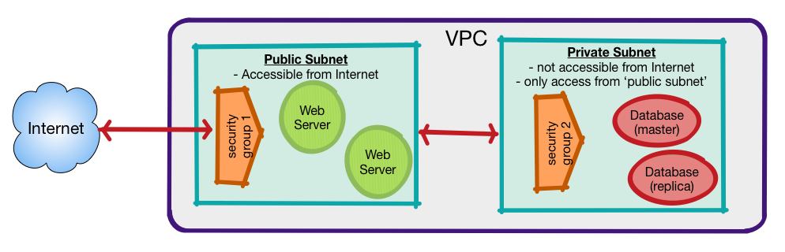
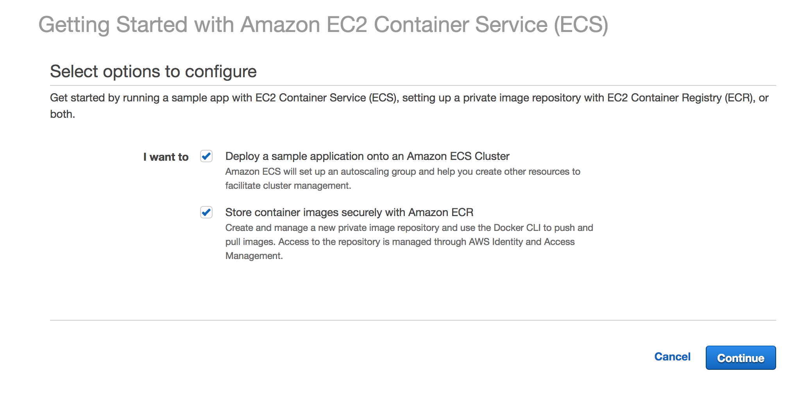
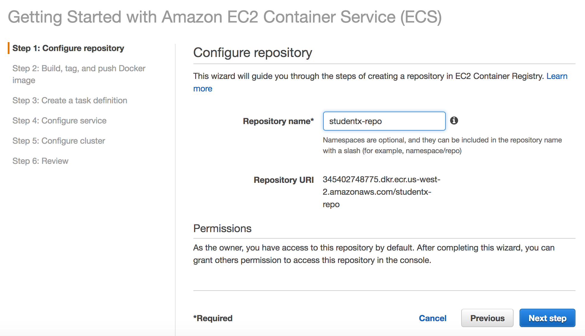
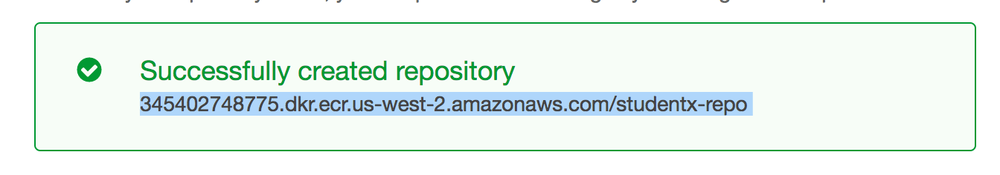
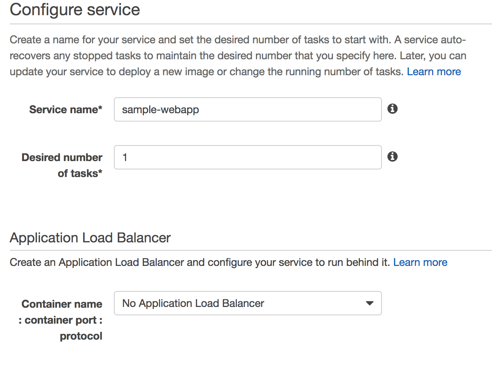
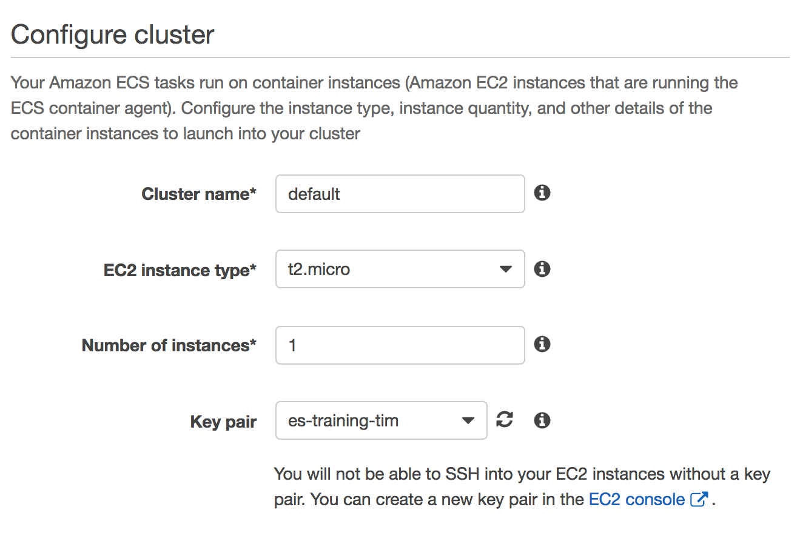

<link rel='stylesheet' href='assets/css/main.css'/>

[<< back to main index](README.md)

---

# ECS

### Overview

In this lab, we will learn about containers and set up a simple container instance.

### Depends On
None

### Run time
45 mins

## Overview
In this lab, we will deploy a simple Docker image to Amazon's ECS service.
* Set up and Build an ECS container.
* Configure a ECS Container repository
* We will be building a simple Docker app from a DockerFile




## Prerequisites

### Docker

Make sure you have docker installed.  On linux:

```
   $ sudo apt-get install docker #ubuntu
   $ sudo yum install docker # RHEL/Centos
```


## Step 1 : ECS Dashboard
Select `Services` --> `ECS`

## Step 2 : Get Started with ECS


## Step 3 : Create ECS Repository


Notice that is returns the name of the repository.  Make a note of this.
Example: 345402748775.dkr.ecr.us-west-2.amazonaws.com/studentx-repo



## Step 4 : Run Docker Login

```
   $ aws ecr get-login --no-include-email --region us-west-2
```
There will be a return:
```
   docker login -u AWS -p XXXXXXXXXXXXXXXXX
```

Cut and paste this return into your shell

you should get a return:

```
Login Succeeded
```

This will return a
## Step 4 : Build Docker Image

```
   $ cd sample-docker-app
   $ docker build -t studentx-repo .
```

You will see a lot out output as the docker image is built. It may take some time.

## Step 5:  Tag the image

```
   docker tag studentx-repo:latest 345402748775.dkr.ecr.us-west-2.amazonaws.com/studentx-repo:latest
```

## Step 6: Push the docker image to the repository.

```
   docker push 345402748775.dkr.ecr.us-west-2.amazonaws.com/studentx-repo:latest
```


## Step 7 :  Create a Task Definition

Create a task definition:  The defaults are fine.


## Step 8 :  Configure Service

Create the service..



## Step 9 : configure Cluster

You can configure the cluster like this.



You will need a key you have access to. If you don't have one already you should create it.

## Step 10: Review and Launch

Click Review and Launch.  If all is well, Select Launch Instance and Run Service.


## Wrap Up
* Group discussion on the lab
* What other variations we can try
