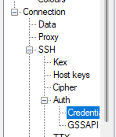

[<< back to main index](../../README.md)

---

# Creating a custom AMI

## Overview:

AWS AMIs contain little more than just an operating system. So to run a PHP web application, for example, you would need to install Apache and PHP. This can be done automatically using user data, or
with an automation tool like Chef or Puppet. However, doing it this way extends the wait time for the instance to be ready.

Many applications, such as those in an autoscaling environment, need instances ready to use immediately. By creating custom AMIs, we can launch pre-configured instances and skip the wait.

In this lab, we're going to create a custom AMI with Apache and PHP already installed. Then, we'll use that AMI to create a new instance that already has that configuration.

To do this, we'll:

Launch an instance from a standard AWS Linux AMI.
Connect to the instance via SSH and manually configure Apache and PHP.
Create a custom AMI.
Create a new instance from the custom AMI and verify that Apache and PHP are installed correctly on it.

## Duration

1 hour and 30 minutes

## Steps:

### Step 1: Sign in to AWS Management Console:

Open the AWS Management Console and log in with your credentials.

### Step 2: VPC

#### Step 2.1: Create a VPC

* Go to VPC > Your VPCs.
* Choose Create VPC, and configure the subsequent settings:
* Choose: `VPC Only`
* Assign the Name tag as: `<YOUR_NAME>-vpc`
* Set the IPv4 CIDR block to: `10.0.0.0/28` (Use the CIDR block that the instructor provides)
* Retain the default values for IPv6 CIDR block and Tenancy.
* Select Create VPC.

#### Step 2.2: Create a Public Subnet

* Click Subnets in the left-hand menu.
* Click Create subnet, and set the following values:
* VPC ID: `<YOUR_NAME>-vpc`
* Subnet name: `<YOUR_NAME>-public-subnet`
* Availability Zone: `us-east-1a` (Or the AZ that the instructor provides)
* IPv4 CIDR block: `10.0.0.0/28` (Or the CIDR block that the instructor provides)
* Click Create subnet.

#### Step 2.3: Enable Auto-assign Public IPv4 Address

**NOTE:** This configuration should only be applied to the public subnet.

* With `<YOUR_NAME>-public-subnet` selected, click Actions > Edit subnet settings.
* Check the box to Enable auto-assign public IPv4 address.
* Click Save.
* Click Internet Gateways in the left-hand menu.

#### Step 2.4: Create Routes and Configure Internet Gateway

* Click Create internet gateway.
* Set Name tag as `<YOUR_NAME>-internet-gateway`.
* On the next screen, click Actions > Attach to VPC.
* In the Available VPCs dropdown, select `<YOUR_NAME>-vpc`.
* Click Attach internet gateway.
* Click Route Tables in the left-hand menu.
* Select the route table related to `<YOUR_NAME>-vpc` and go to the "Routes" tab. (By the VPC id)
* On the next screen, click Edit routes.
* Click Add route, and set the following values:
    * Destination: `0.0.0.0/0`
    * Target: Internet Gateway, `<YOUR_NAME>-internet-gateway`
* Click Save changes.

### Step 3: Create a New Security Group

- Return to the EC2 Dashboard and click on “Instances”.
- Click on the “Create Security Group” button.
- **Name your Security Group**: Provide a descriptive name, e.g., `<YOUR_NAME>-webserver-sg`.
- **Description**: Add a brief description, e.g., "Security group for web servers".
- **VPC**: Choose `<YOUR_NAME>-vpc` to associate with this security group.
- **Add Rules**:
    - Under the "Inbound rules" create the following rules
        - Type: HTTP, Source: Anywhere
        - Type: SSH, Source: Anywhere
        - Type: HTTPS, Source: Anywhere

- Click “Create security group”.

### Step 4: Create the EC2 instance

- Click the “Launch Instance” button.
- Enter `<YOUR_NAME>-template` under “Name”.
- **Choose an Amazon Machine Image (AMI)**: Select the "Ubuntu 22.04 LTS".
- **Choose an Instance Type**: Select "t2.large".
- **Key Pair**: (Mandatory)
    - Create a new key pair and name it `<YOUR_NAME>-keypair-ppk`.
    - Use `RSA` as the key pair type and `.ppk` as the file format.
- Click on Edit in front of Network Settings.
    - Make sure you are selecting `<YOUR_NAME>-vpc` under VPC.
    - Select `<YOUR_NAME>-public-subnet` under Subnet.
    - Choose `Select existing security group` and select `<YOUR_NAME>-webserver-sg` from the dropdown.
- Click “Launch Instances”.

### Step 6: Access the EC2 Instance

This step requires `PuTTY` which can be downloaded from [here](https://www.chiark.greenend.org.uk/~sgtatham/putty/latest.html)

Instructor will explain how to access the EC2 instance using PuTTY.

username: `ubuntu` (All lowercase)

Private key location on PuTTY: `Connection > SSH > Auth > Private key file for authentication`



### Step 7: Update the package repositories

```bash
sudo apt update -y
sudo apt upgrade -y
```

### 4. Install Apache:

```bash
sudo apt install apache2 -y
```

- Once installed, you can check the status of Apache:

```bash
sudo systemctl status apache2
```

- Ensure your AWS security group allows traffic on port 80. Now, if you navigate to `http://YOUR_EC2_PUBLIC_IP`, you should see the Apache2 default page.

### Step 8: Install PHP

1. Install PHP and some commonly used extensions:

```bash
sudo apt install php libapache2-mod-php php-cli php-fpm php-json php-common php-mysql php-zip php-gd php-mbstring php-curl php-xml php-pear php-bcmath -y
```

2. Check the PHP version:

```bash
php -v
```

### Step 9: Test PHP on Apache

- Remove the default Apache index.html file:

```bash
sudo rm /var/www/html/index.html
```

- Replace the default Apache index.html file with a PHP file:

```bash
echo "Hello <?php echo gethostname(); ?>" | sudo tee /var/www/html/index.php
```

- Restart the Apache service:

```bash
sudo systemctl restart apache2
```

- Now, if you navigate to `http://YOUR_EC2_PUBLIC_IP`, you should see the PHP info page, indicating PHP is working correctly with Apache.

- close the ssh connection

### Step 10: Create a Custom AMI

- Go to EC2 > Instances.
- Select the instance you just created and click Actions > Image and templates > Create image.
- **Image name**: `<YOUR_NAME>-webserver-ami`
- **Image description**: `<YOUR_NAME>-webserver-ami`
- Click on Create image.
- Go to EC2 > AMIs.
- Wait for the AMI to be created. Once it's available.

This operation will take a few minutes to complete. Once it's done, you can use the AMI to launch new instances with Apache and PHP already installed.

## Clean Up

Make sure to delete the following resources:

- EC2 instance `<YOUR_NAME>-template`
- VPC `<YOUR_NAME>-vpc`
- Internet Gateway `<YOUR_NAME>-internet-gateway`

DO NOT DELETE THE AMI, AS IT WILL BE USED IN THE NEXT LABs.

### Conclusion:

Congratulations! You've successfully created a custom AMI with Apache and PHP installed.