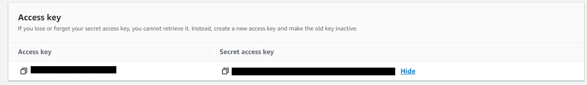

[<< back to main index](../../README.md)

---

# AWS Access Keys

## Overview

In this labs you will learn how to create and use access keys to interact with AWS.

## Depends On

- [login](login.md)

## Duration

30 minutes

## Regions

- Global

### Step 1 : Login

Login to the aws account.

### Step 2: Security credentials

Go to the `Users` section and select your user.

### Step 3: Create Access Key

* Select `Security credentials` tab
* Select `Create access key` from `Access keys` panel
* Select `Command Line Interface (CLI)` and check `I understand the above recommendation and want to proceed to create an access key.`
* Write a value for `Description tag value`, While this is optional, it is recommended to add a description to your access key.
* Select `Create access key`

### Step 3: Create Access Key

Download the .csv file for future reference.

You can also get you keys from the `Access key` panel on the current page.

## Important Note

You can not get your `Secret access key` after this step. Make sure to back it up.