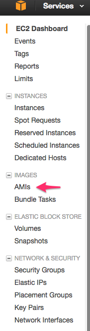
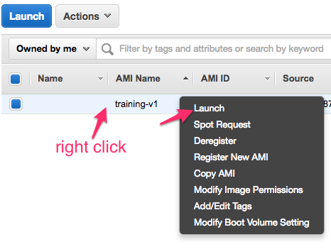

<link rel='stylesheet' href='assets/css/main.css'/>

[<< back to main index](README.md)

---

# Launch EC2 Instance

### Overview
Login and access AWS console

### Depends On
None

### Run time
10 mins


## Step 1 : Login to AWS console
Instructor will provide credentials

## Step 2 : EC2 Dashboard
Click on `Services`,  select `EC2`.


## Step 3 : Select AMI
Select the latest version of `training` AMI --> `Launch`




## Step 4 : Select the following settings
#### 4.1 - Instance type
`t2.medium`

#### 4.2 - Make sure the instance has a `public IP`
  


#### 4.3 - Stick with default storage settings (click next)

#### 4.4 - Tags
Give a name to match your student id `studentX` (e.g. student1)

### 4.5 - Security Groups
Select `Choose existing` --> select `open`

#### 4.6 - Confirm key
Choose `es-training` key

#### 4.7 - Verify instance is running
Navigate to `Instances` section and make sure your instance is up and running


## Step 5 : Instance Details
Click on your instance and observe the details pane


## Step 6 : Access the instance

### 6.1 - Web UI
Type in the `public-ip` in your browser URL.  
You should see the default web page.

### 6.2 - Desktop UI (port `8000`)
* In your browser go to :  http://your_machine_ip:8000
* Click on `vnc.html`
* login to desktop  (Instructor will provide credentials)
  

### 6.3 - (optional) SSH
* Use your favorite SSH client
   - Windows : [Putty](http://www.putty.org/)  / [SecureCRT](https://www.vandyke.com/products/securecrt/) / [Moba](http://mobaxterm.mobatek.net/)
   - Linux / Mac : `ssh` command from terminal
* Use the following credentials
    - host : public_ip of your instance
    - user : ubuntu
    - password : instructor will provide
* On Linux / Mac use the following command
  ```bash
        ssh  -l ubuntu   public_ip_of_your_instance
  ```

putty:

  
