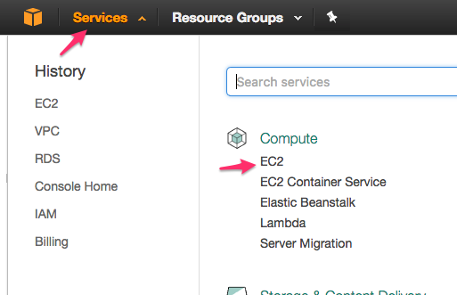

<link rel='stylesheet' href='assets/css/main.css'/>

[<< back to main index](README.md)

---

# Setup an Elastic Load Balancer

### Overview
Setup and configure ELB

### Depends On
None

### Run time
30 mins


## Step 1 : Login to AWS console
Instructor will provide credentials

## Step 2 : EC2 Dashboard
Click on `Services`,  select `EC2`.



## Step 3: Launch Two Web Servers
* Go to `AMI` section
* Select `private AMI` dropdown
* Launch `2 instances` of the latest version of `webserver` AMI

## Step 4: Access Web Servers
* Note the public IP addresses of the web servers we just launched
* Access those IP addresses using a browser
* You should see a standard web page like this


## Step 5: Modify default page of one web server
* Login to one web server
* Modify the default web page as follows
```bash
  $   sudo vi /var/www/html/index.html
```
around line 199 change the title from  
    `Apache2 Ubuntu Default Page (A)`  to  'Apache2 Ubuntu Default Page (<mark>B</mark>)'
* This way we can distinguish one webserver from another
* Load the modified page in browser and make sure you see the modified heading


## Step 6: Create Load Balancer


## Step 7: Select standard VPC and Choose a protocol
We will use `HTTP` protocol


## Step 8: Add optional Availability Zones


## Step 9: Security Group
Choose `web server` security group.  This will allow HTTP and SSH protocols to pass through.


## Step 10: Health Check
ELB will perform heath checks on EC2 instances to detect if they are operating OK


## Step 11: Add Ec2 instances to ELB
Add the two webservers you just created.


## Step 12: ELB created

Check ELB info page.
* `Description` tab : Note the 'ELB end point'
* `Instances` tab : Make sure both webservers are online and serviceable
* `Monitoring` tab : Examine this tab for metrics


## Step 13: Testing ELB
* Access the ELB end point in the browser
* You will see the standard web page  
* Reload again, you will probably see a page from another web server
* Reload again, what do you see?

Sample images:


## Bonus Lab : Testing ELB in volume
* Login to your `workstation` machine (not the webservers)
* Run the `Apache Benchmark` as follows
```bash
       #  n : number of requests
       #  c : concurrent requests
  $   ab  -n 100  -c 4
```
* Inspect the `monitoring tab` of ELB to see the stats
