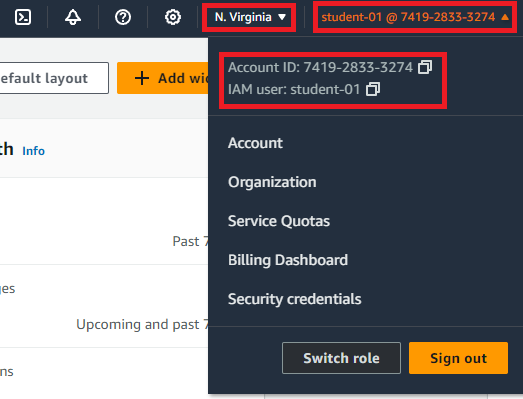

<link rel='stylesheet' href='assets/css/main.css'/>

[<< back to main index](README.md)

---

# Access AWS Console

### Overview
Login and access AWS console

### Depends On
None

### Run time
10 mins

## Step 1 : Obtain login details
Instructor will provide these

## Step 2 : Login
* Go to [https://345402748775.signin.aws.amazon.com/console](https://345402748775.signin.aws.amazon.com/console)
* Make sure 'account id' is '345402748775'
* Enter user name and password

## Step 3 : Ensure you are in right region
For this lab we are using **US-Oregon (us-west-2)** region.

