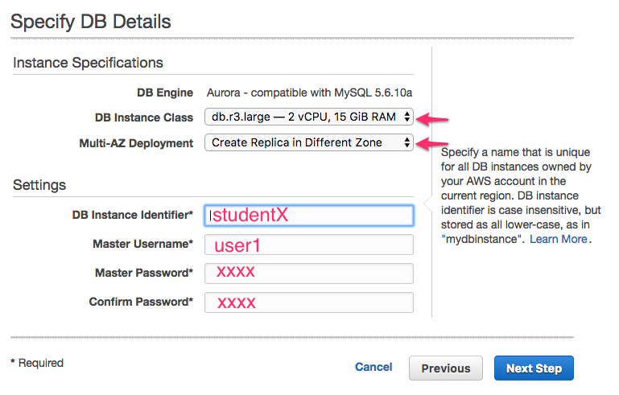
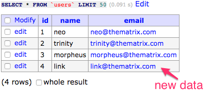

<link rel='stylesheet' href='assets/main.css'/>

[<< back to main index](README.md) 

---

# RDS

### Overview
Use RDS service

### Depends On 
None

### Run time
40 mins

## Step 1 : Go to RDS Dashboard
Choose `Services` --> `RDS`

## Step 2 : Launch RDS Wizard

## Step 3 : Select `Aurora` engine
 

## Step 4 : DB Settings
* Instance : `db.r3.large`
* Multi-AZ deployment : `yes`
* DB Instance identifier : `studentX` (e.g.  student1)
* User : `user1`
* Password : any password
 

## Step 5 : DB Settings (VPC and replica)
* Accept default values for most settings 
* Security group : `open`
* Name cluster / db   
   

## Step 6 : Checkout DB Instances
Observe the following
* DB & replica
* cluster / write endpoints

 

 

## Step 7 : Testing The DB
We will use [Adminer UI](https://www.adminer.org/) to connect to RDS instances.  
Our Ubuntu desktop will act as a 'client'.  

 

#### 7.1 Open Adminer UI
In browser go to  : [http://your_pulic_ip/adminer.php](http://your_public_ip/adminer.php)

#### 7.2 Enter DB settings
* system : `mysql`  (Aurora is MySQL protocol compatible)
* server : `cluster end point` (get this from RDS dashboard)
* user : `user1` (or what ever the user name you entered when setting up RDS)
* password : `what ever the pw for RDS`

 

If connection is successful, you will see the DB screen

 

## Step 8 : Create Table

* Select `db1`
* Select `Import`
* Choose `data/users.sql` file from lab bundle
* `Execute` the import

 

This will create a table called `users` and populate it with some data.

 

## Step 9 : Verify Replica
* Disconnect / Logout from master
* In login screen, enter the `reader endpoint` URL as server
* user name : `user1` and the password
* Connect
* Inspect `db1` and table `users`
* Verify it has the data

## Step 10 : Take a snapshot
 

View  `Snapshots` section and make sure the snapshot is created and available.

## Step 11 : Restore the snapshot
* Click on `Snapshots` section
* Select the snapshot and select `Restore`
* Follow the wizard to restore 