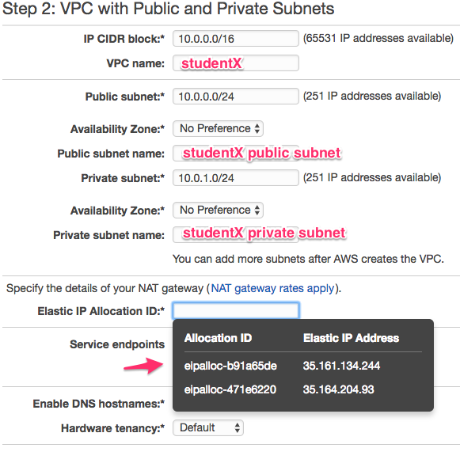
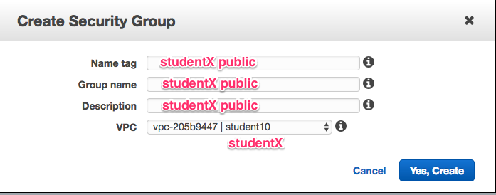
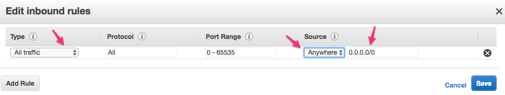
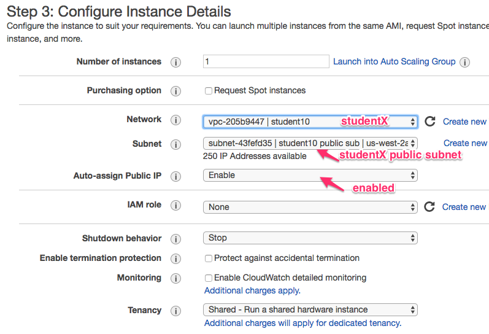
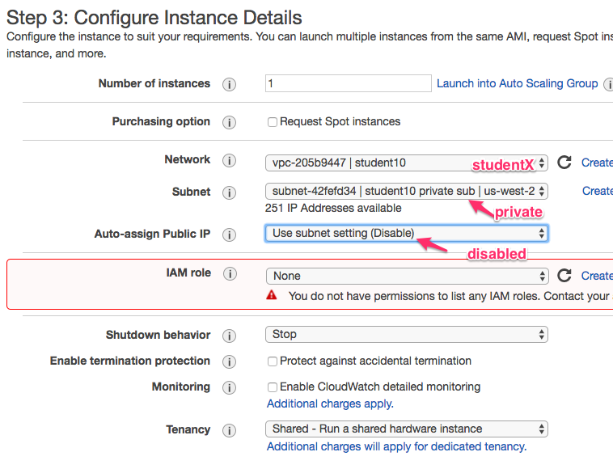
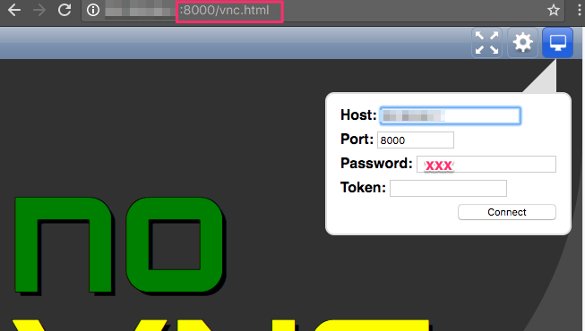
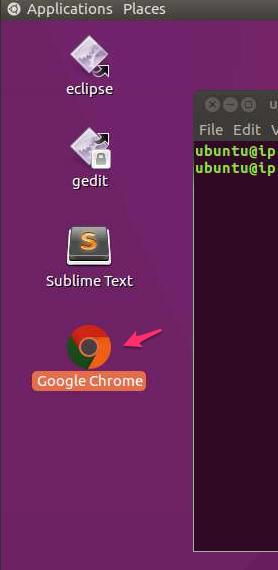
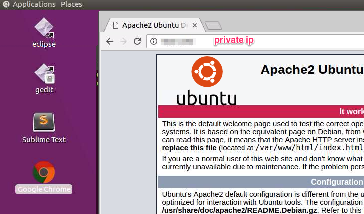

<link rel='stylesheet' href='assets/main.css'/>

[<< back to main index](README.md) 

---

# VPC

### Overview
Setup VPC and Subnets

### Depends On 
None

### Run time
45 mins

## Overview
In this lab, we are going to create a network setup for running a web service.
* We will have a VPC with two subnets - one public and one private
* The public subnets allow traffic from the Internet - this will host our web servers
* The private subnets are not reachable from the Internet, they are only reachable from 'public subnet'.  This will host our databases

 

## Step 1 : VPC Dashboard
Select `Services` --> `VPC`

## Step 2 : Create an Elastic IP
We need an EIP to act as our 'Internet Gateway'.
* Select `Elastic IPs`
* Create a new EIP
* Make a note of your EIP, we will be using this momentarily

## Step 3 : Create VPC and Subnets
* Select `Services` --> `VPC`
* Go to `VPC Dashboard`
* Click on `Start a VPC Wizard`
* Choose `VPC with private and public subnets`
* Specify settings as follows
   

Once the VPC is created, verify the following sections have newly created artifacts
* VPC
* Subnets 
* NAT Gateways

## Step 4 : Create Security Groups

### 4.1 - Public
* Create a security group as follows
   
* Allow all inbound traffic as follows
   

### 4.2 - Private
* Create another `private` security group
* Allow all traffic from `public group` we created earlier

## Step 5 : Launch a 'web server' instance
* Go to `AMI` section
* Launch the latest `training` AMI
* Choose instance type : `t2.medium`
* Set network settings as follows
   
* Name it as : `studentX public`
* Select public security group : `studentX public subnet`

## Step 6 : Launch a 'db' instance
* Follow the steps as above to create another instance
* Set network settings as follows
   
* We are giving a `PRIVATE IP` address
* Name it as : `studentX private`
* Select private security group : `studentX private subnet`

## Step 7 : Access Web Server
* In browser go to the `public` ip of the 'webserver' instance
* You will see the default website

## Step 8 : Access 'db' server
* Since the db server has private IP, it is not accessible from the Internet (you can try it)
* This db instance is only accessible from machines in 'public subnet'

## Step 9 : Remote desktop
* Access remote desktop by going to `http://public_ip:8000`
* Open `vnc.html`
* Enter password for access
   
* Once in desktop, open `chrome` browser  
  
* Access the `private` ip of our 'db server' from chrome.  You'd see the default web page  
  

## Wrap Up
* Group discussion on the lab
* What other variations we can try
